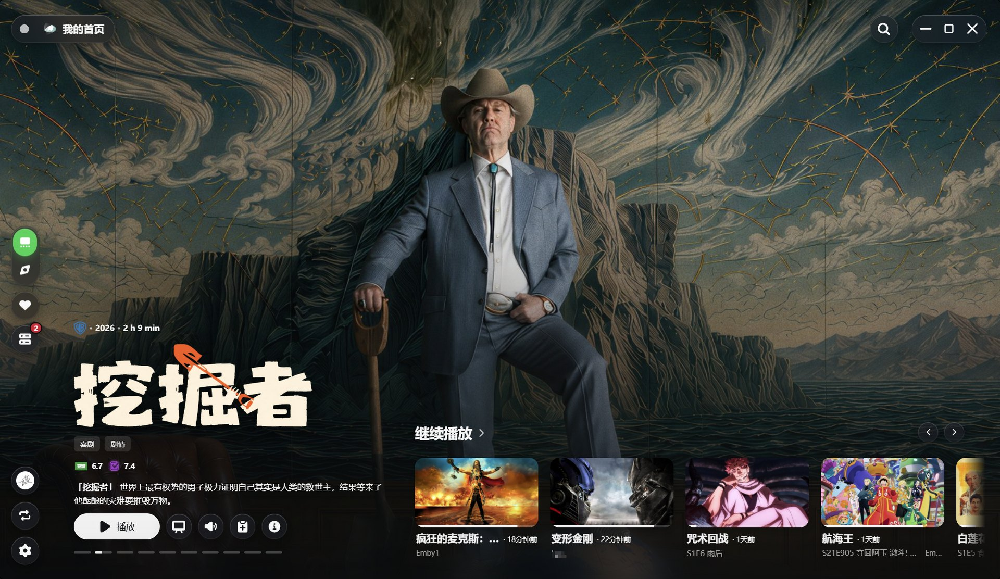
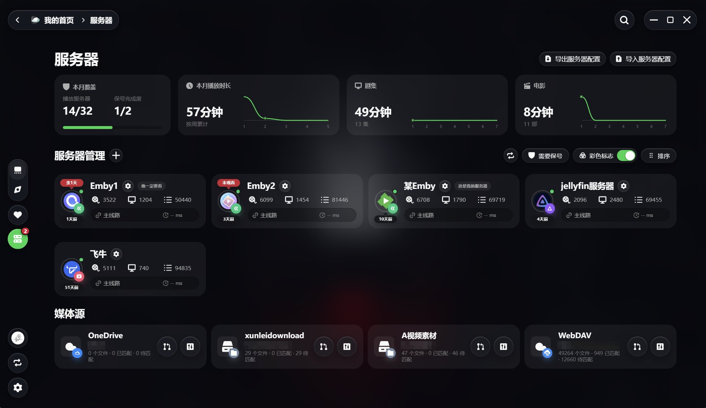
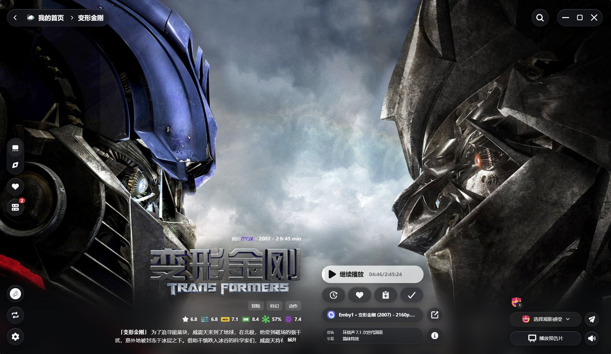
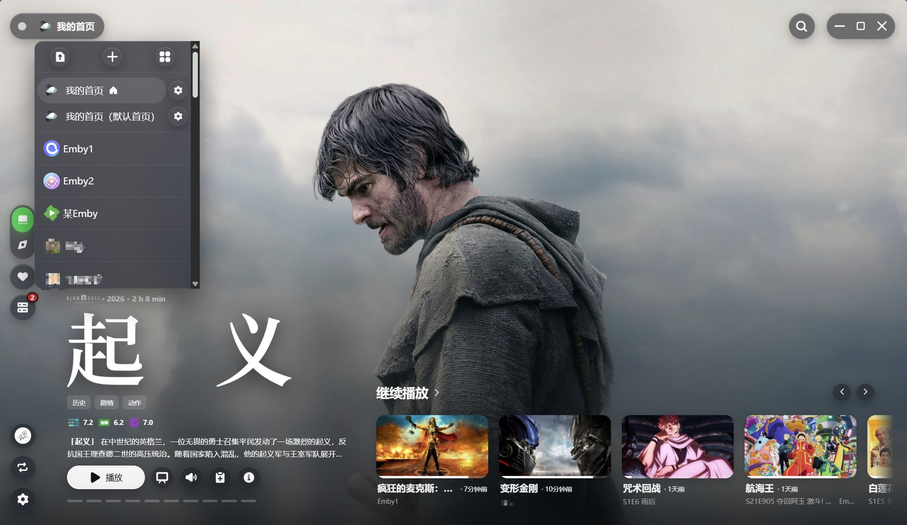
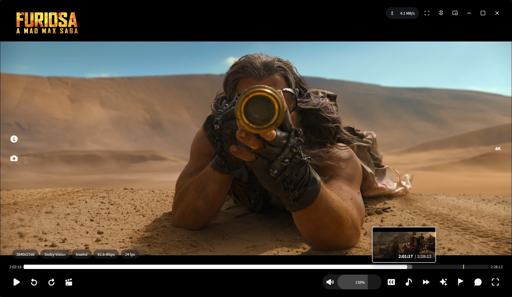
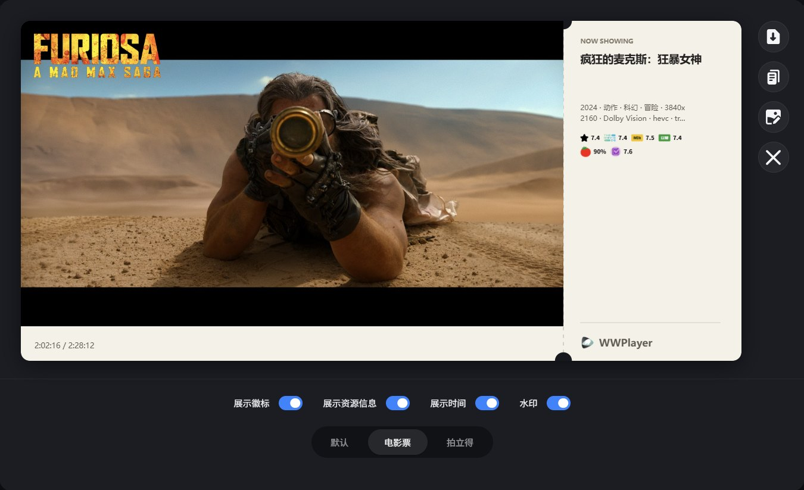
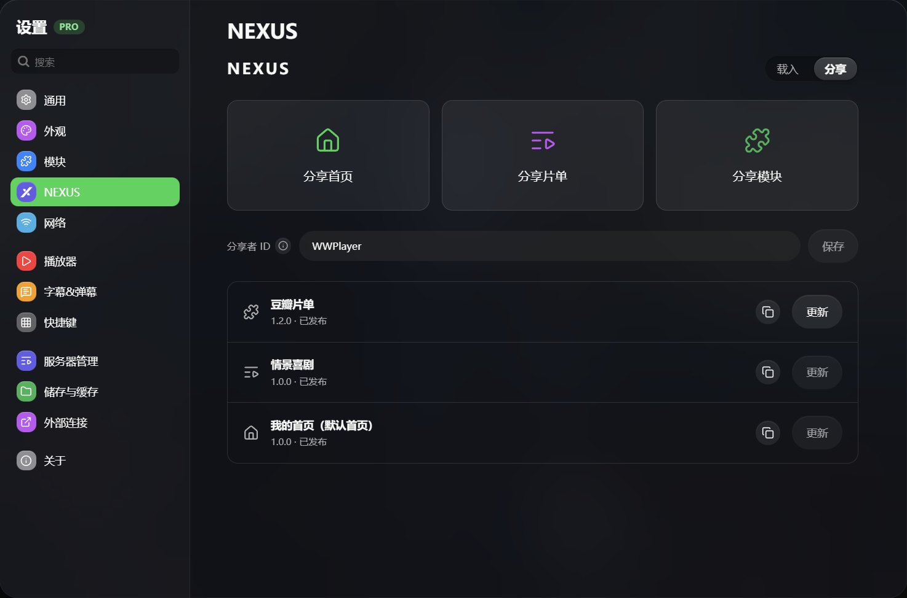
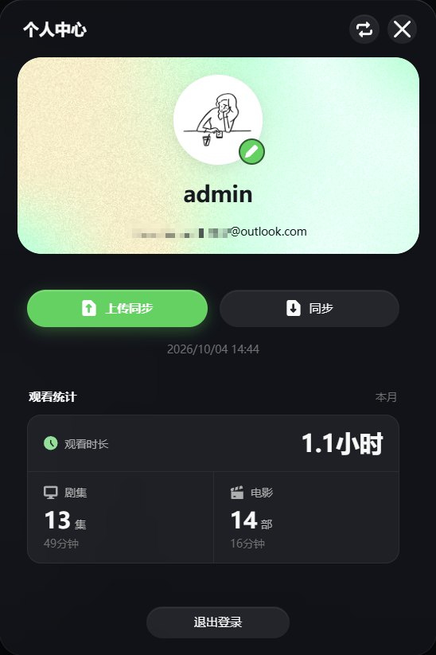

  <a href="./README.md">简体中文</a> |
  <a href="./README.zh-TW.md">繁體中文</a> |
  <strong>English</strong>

  
  <h1>WWPlayer</h1>
  
<strong>Your collections. One home.</strong>

  
Bring Emby, Jellyfin, FNOS Video, cloud drives, NAS shares, and local folders together. Play with libmpv.

  

    
    
    
    
  

  

    <a href="https://wwplayer.com">Website</a> ·
    <a href="https://wwplayer.com/docs.html">User guide</a> ·
    <a href="https://nexus.wwplayer.com">NEXUS</a> ·
    <a href="https://t.me/WWPlayer_chat">Telegram</a>
  

  

WWPlayer is a Windows desktop client for personal media libraries. Browse media, search for titles, organize playlists, track viewing progress, and play through the built-in libmpv engine in one interface.

> [!IMPORTANT]
> WWPlayer does not provide, store, or distribute media content. You must supply media servers, network storage, or local files that you are legally allowed to access.

## 🧩 Many sources, one place

| Category | Supported sources |
| --- | --- |
| Media servers | Emby, Jellyfin, FNOS Video |
| Network storage | WebDAV, OpenList, OneDrive, SMB |
| Local media | Windows folders |
| Metadata and tracking | TMDB, Trakt, IMDb, Bangumi |
| Extensions | Modules, custom playlists, M3U / M3U8 live TV |

- Each source keeps its own credentials, endpoints, and capabilities. Manage server endpoints, latency checks, notes, and account keep-alive reminders.
- OneDrive supports browser authorization; file-based sources support directory browsing and playback.
- **Pro** aggregates search, favorites, continue watching, and matching resources across servers. Select sources by format, resolution, bitrate, and size from details or during playback.
- **Pro** adds TMDB metadata matching and manual corrections for local, WebDAV, and OpenList media.

  
<strong>View media sources and title details</strong>

   
  
  

## 🏠 Make the home screen yours

Home screens, multiple homes, sections, and modules are available in the free edition. Create separate homes for movies, series, anime, or family members, with custom names, icons, ordering, and a primary home.

- Combine TMDB, Trakt, IMDb, libraries, folders, playlists, and modules with poster, ranking, collage, calendar, and live TV layouts.
- Use background carousels, continue watching, favorites, drag-and-drop section ordering, and home import/export.
- Connect Trakt for viewing progress and release calendars, or Bangumi for anime collection status and broadcast calendars.
- Enable independent viewing history for a home to keep its records separate from other local continue-watching sources and avoid reporting them to Trakt.

## ▶️ Picture and sound, thoughtfully handled

Built-in libmpv plays in a separate native video window; external mpv is also supported. Switch episodes and sources, select tracks, and adjust subtitles, speed, picture, and sound during playback.

- **Video**: Hardware decoding, GPU selection, and `gpu-next` / `gpu` output. Recognizes HDR10, HDR10+, HLG, and Dolby Vision, with HDR output or SDR tone mapping according to Windows HDR status and settings.
- **Audio**: Stereo downmix, voice enhancement, and night mode.
- **Subtitles**: Embedded, external, and local subtitles with language preferences, styling, and timing controls. Online subtitle search and loading require **Pro**.
- **Danmaku**: Multiple sources, local files, activity heatmaps, and font, speed, area, and filtering controls.
- **Controls**: Timeline thumbnails, intro/outro markers and skipping, custom shortcuts, windowed and fullscreen modes.
- **Cache**: Buffer and full-cache settings. The Beta engine supports next-episode media preloading when enabled; it cannot run alongside full-cache mode.
- **Anime4K (Pro)**: Anime upscaling.

> HDR / Dolby Vision results depend on the media, GPU, drivers, display, and Windows settings; recognition does not guarantee native Dolby Vision metadata passthrough on every device. Preloading also depends on the media format, source, and server responses.

## 📸 Keep your favorite moments

Click the capture button for a screenshot, or hold it to record a GIF of up to approximately 10 seconds. Choose a default, movie-ticket, or landscape Polaroid layout, then save, copy and save, or set it as your profile background.

Title details also show public viewing reactions. Sign in to a WWPlayer account to choose and submit your own emoji reaction.

## 🌐 NEXUS and modules

Share and load home screens, playlists, and modules through [NEXUS](https://nexus.wwplayer.com).

- Load a work with a share code or local file; shared homes can include required modules.
- Manually sync online imports to their latest version. Sync replaces the corresponding content and does not preserve local edits to it.
- Sign in to publish and update your own works, or export local files without publishing.
- Install modules from files, URLs, or a module index to extend sections, search, and media resources.

## ☁️ Accounts, configuration, and backups

A WWPlayer account provides a profile, monthly viewing statistics, and cloud configuration sync. The first sign-in for an account on each device attempts to restore existing cloud configuration. Later uploads and restores are manual; app startup does not repeatedly overwrite local changes.

- Cloud configuration can include servers, endpoints, homes, modules, and general preferences. Restoring it does not overwrite local playback history or Store licensing.
- Import/export server configuration as `.wwpcfg`; **Pro** also supports WebDAV configuration backup and restore.
- WebDAV backups use only your WebDAV login credentials, without a separate backup password.

> Configuration may contain media-server credentials. Account backups use server-managed encryption, not end-to-end encryption. WebDAV backups rely on service permissions and HTTPS, so use trusted private storage. Check NEXUS works for sensitive information before publishing.

  
<strong>View the profile and viewing statistics</strong>

   
  

## ✨ Free and Pro

| Free edition | Pro adds |
| --- | --- |
| 1 Emby, Jellyfin, or FNOS Video server | Unlimited media servers |
| Local, WebDAV, OpenList, OneDrive, and SMB sources | Cross-server search, favorites, continue watching, and resource aggregation |
| Homes, multiple homes, sections, modules, and playlists | Cross-server source switching in details and the player |
| Built-in libmpv, external mpv, subtitle tracks, local subtitles, danmaku, screenshots, and GIFs | Online subtitle search and loading, Anime4K |
| TMDB, Trakt, and Bangumi connections | Metadata matching and corrections for local, WebDAV, and OpenList media |
| WWPlayer accounts and configuration sync, NEXUS loading and local export | WebDAV configuration backup and restore |

Homes and modules themselves do not require Pro; any Pro data capabilities they use remain subject to licensing. Pro is licensed through Microsoft Store, with pricing and validity shown in the app's Store information. Neither a WWPlayer account nor a media-server account grants Pro.

## 📦 Download and get started

**Windows 10 / 11 · x64 · 1.3.0**

[Get WWPlayer from Microsoft Store](https://apps.microsoft.com/detail/9ND8050FCRG2). See the [Wiki](./docs/wwplayer-wiki.md#安装更新与数据位置) for MSIX and Portable installation and data locations.

1. Open Servers and add a media server, network storage, or local folder.
2. Optionally connect TMDB, Trakt, or Bangumi, and configure subtitles, danmaku, and the player.
3. Browse a home or library, open a title, select a source, and play.

See the [online guide](https://wwplayer.com/docs.html) or [repository Wiki](./docs/wwplayer-wiki.md) for full instructions and troubleshooting (Chinese). Screenshots show version 1.3.0; available content depends on your sources.

## 🙏 Related projects and services

[mpv](https://mpv.io/) · [Electron](https://www.electronjs.org/) · [React](https://react.dev/) · [TMDB](https://www.themoviedb.org/) · [Trakt](https://trakt.tv/) · [Bangumi](https://bgm.tv/) · [Emby](https://emby.media/) · [Jellyfin](https://jellyfin.org/)

Third-party names and trademarks belong to their respective owners. When reporting issues, include the version, source type, reproduction steps, and sanitized logs.

Development: [Maintenance, validation, and releases](./docs/project-maintenance.md) · [Active code map](./ACTIVE_CODE_MAP.md)
