

  <a href="./README.md">简体中文</a> |
  <strong>繁體中文</strong> |
  <a href="./README.en.md">English</a>

  
  <h1>WWPlayer</h1>
  
<strong>連接 Emby、Jellyfin、飛牛影視，以及本機目錄、WebDAV、OpenList、OneDrive 和 SMB，將分散內容彙整至統一媒體庫；透過可自由編排的首頁、豐富欄目與多樣化內容元件，打造獨一無二的沉浸式觀影空間。</strong>

  
統一瀏覽、跨服彙整、智慧選源，並使用內建 libmpv 完成高品質播放。

  

    
    
    
    
    
  

  

    
  

WWPlayer 是一款面向個人媒體庫的 Windows 桌面用戶端。它可以同時連接 Emby、Jellyfin、飛牛影視，以及本機資料夾、WebDAV、OpenList、OneDrive 和 SMB，將分散在不同位置的影片集中到同一套首頁、搜尋、詳情、片單與播放流程中。

> [!IMPORTANT]
> WWPlayer 本身不提供、儲存或散布任何影視內容。使用者需要自行準備合法且可存取的媒體伺服器、網路儲存或本機媒體，並對所連接內容的使用權限負責。

## ✨ 快速了解 WWPlayer

- **多來源統一管理**：伺服器、網路硬碟、NAS 分享與本機資料夾集中管理，不必在多個用戶端之間反覆切換。
- **跨伺服器彙整**：搜尋、收藏、繼續觀看、播放進度與同名資源可以跨伺服器整理到一起。
- **更完整的選源體驗**：在詳情頁或播放中依特殊格式、解析度、位元率與檔案大小篩選及切換資源。
- **自由編排的探索首頁**：組合 TMDB、Trakt、IMDb、媒體庫、本機資料夾、片單與探索模組，支援多種欄目版面。
- **內建 libmpv 播放**：支援硬體解碼、GPU 輸出、快取控制、音軌字幕、彈幕、自訂快速鍵與獨立播放器視窗。
- **高動態範圍相容**：辨識 HDR10、HDR10+、HLG 與 Dolby Vision 資源，並依 Windows HDR 狀態進行 HDR 輸出或 SDR 色調映射。
- **追劇輔助能力**：繼續觀看、觀看狀態、Trakt 進度、追劇日曆、片頭片尾標記，以及下一集預載（Beta）。
- **設定移轉與同步**：伺服器設定可匯入/匯出為 `.wwpcfg`，並提供 WebDAV 多裝置設定同步能力。

## 🧩 支援的媒體來源

| 類別 | 支援項目 | 主要能力 |
| --- | --- | --- |
| 媒體伺服器 | Emby、Jellyfin、飛牛影視 | 媒體庫、詳情、劇集、搜尋、收藏、觀看狀態、資源與線路管理 |
| 網路儲存 | WebDAV、OpenList、OneDrive、SMB | 資料夾瀏覽、媒體掃描、海報與縮圖、直接播放、繼續觀看；OneDrive 支援瀏覽器登入 |
| 本機媒體 | Windows 本機資料夾 | 媒體掃描、資料夾瀏覽、本機播放紀錄、繼續觀看 |
| 內容與追蹤 | TMDB、Trakt、IMDb | 中繼資料、熱門與榜單、追劇日曆、播放進度、個人片單與推薦 |
| 擴充來源 | 探索模組、M3U / M3U8 | 自訂探索資料、模組詳情與資源、電視直播欄目 |

> [!NOTE]
> 不同伺服器版本、API 權限與媒體組織方式可能影響部分能力。飛牛影視、Jellyfin 與各類儲存來源會依各自可用介面呈現功能，不會強行模擬不存在的伺服器能力。

## 🏠 首頁與繼續觀看

首頁以沉浸式背景輪播展示近期內容，同時保留繼續觀看、最近更新與收藏等常用入口。繼續觀看可以合併多個伺服器、Trakt 與本機來源的進度，並保留劇集、集數與播放進度資訊。

- 輪播背景可使用伺服器或 TMDB 圖片，並支援詳情背景輪播。
- 繼續觀看支援跨來源彙整、移除紀錄、清除進度與跳轉來源伺服器。
- 多個伺服器上的同一影片可合併進度，減少重複卡片。
- 可依伺服器控制是否參與首頁、搜尋、收藏與繼續觀看彙整。

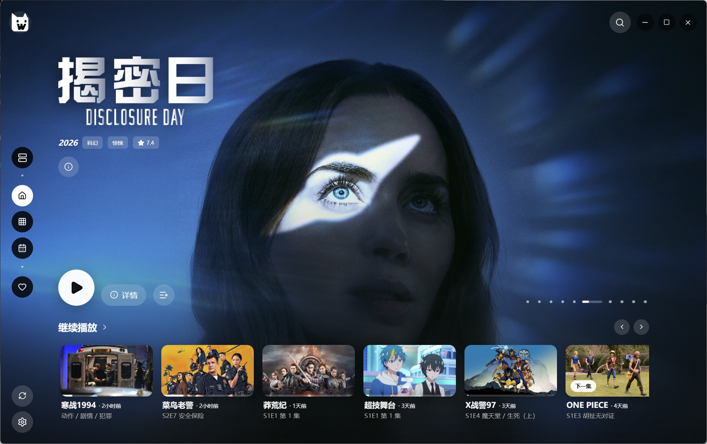

## 🎬 詳情、劇集與多資源

詳情頁不只展示簡介，也會把同一影片在不同伺服器、線路與媒體檔案中的可播放資源集中起來。資源卡片可展開查看路徑、封裝、解析度、視訊編碼、動態範圍、位元深度、位元率、影格率、音軌與字幕等資訊。

- 同名影片與劇集可跨伺服器彙整，保留真實來源與線路。
- 支援依特殊格式、解析度、位元率與大小排序，並記憶常用選源偏好。
- 播放前可選擇音軌與字幕，播放中仍可快速切換資源。
- 劇集支援季/集瀏覽、觀看狀態維護、整季標記與下一集更新提示。
- 演職員、藝術圖、相似內容與推薦內容集中在同一詳情頁。

  
<strong>查看完整資源參數、演職員與相關推薦</strong>

   
  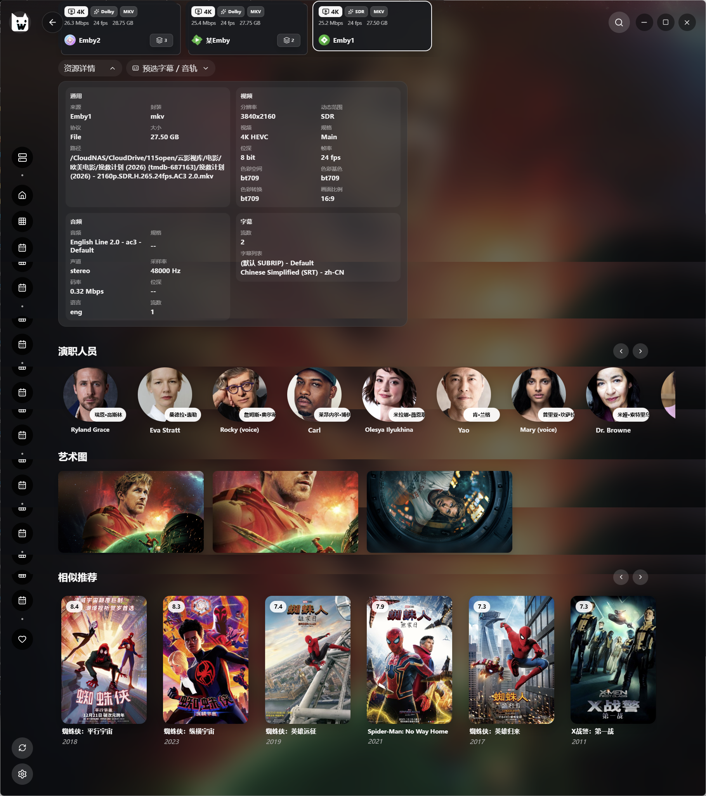

## 🧭 探索頁與欄目系統

探索頁是一套可編輯的內容工作台。每個欄目都能獨立選擇資料來源、標題、排序方式與視覺版面，再透過拖曳調整順序。

- 內建熱門電影、熱門影集、趨勢、高分、正在熱播與動畫新番等 TMDB 欄目。
- 支援 Trakt 熱門、趨勢、期待、收藏、推薦、個人清單與追劇日曆。
- 支援 IMDb 分類、伺服器媒體庫、本機資料夾、自訂片單與探索模組。
- 提供海報、橫向海報、景觀圖、排行、趨勢、焦點、拼貼、分類、排行榜、資料夾、日曆與電視直播等版面。
- 電視欄目可讀取本機 M3U / M3U8、遠端 M3U URL 或單一直播網址。
- 欄目可以啟用、隱藏、重新命名、排序或獨立設定資料來源。

  
<strong>展開查看完整探索頁與多種欄目版面</strong>

   
  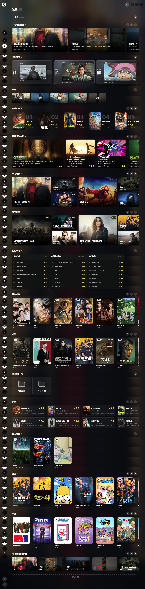

## ▶️ 播放體驗

WWPlayer 預設使用內建 libmpv，在獨立原生視訊表面上播放；介面控制、伺服器工作階段、驗證、Proxy、快取與播放進度仍由 WWPlayer 管理。也可以切換至外部 mpv，外部播放器會使用自己的設定、腳本與 `portable_config`。

### 畫面與聲音

- 支援常見 MP4、MKV、TS、M2TS、WebM 等封裝，以及 H.264、HEVC、AV1 等常見視訊編碼；實際解碼範圍取決於隨附的 libmpv / FFmpeg 與裝置能力。
- 辨識 HDR10、HDR10+、HLG、Dolby Vision 等動態範圍標籤，並顯示解析度、編碼、位元深度、位元率與影格率。
- 依 Windows HDR 狀態與播放器設定選擇輸出策略；在 SDR 環境下對 HDR / Dolby Vision 來源執行相容色調映射。
- 支援自動安全硬體解碼、D3D11VA、D3D11VA Copy、GPU 選擇，以及 `gpu-next` / `gpu` 輸出。
- 提供立體聲下混、人聲增強與夜間模式等音訊處理選項。

### 播放控制

- 播放/暫停、快進快退、音量、靜音、倍速、全螢幕、選集、音軌、字幕與資源切換。
- 播放中直接搜尋並切換其他伺服器上的同名資源。
- 可調整緩衝時間與快取大小，提升遠端媒體播放穩定度。
- 支援視窗、最大化與全螢幕啟動模式，可選擇播放時最小化主視窗。
- 支援片頭、片尾時間點標記與自訂播放器快速鍵。
- 內建播放可啟用自訂 `mpv.conf`；外部 mpv 的設定由外部程式自行管理。

<table>
  <tr>
    <td width="50%"></td>
    <td width="50%">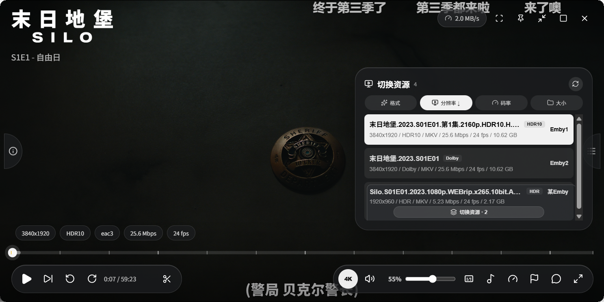</td>
  </tr>
  <tr>
    <td align="center">媒體資訊、字幕、彈幕與完整播放控制</td>
    <td align="center">播放中依格式、解析度、位元率與大小切換資源</td>
  </tr>
</table>

### 🧪 Beta 播放能力

| 下一集預載（Beta） | 時間軸縮圖（Beta） |
| --- | --- |
| 在目前劇集播放時準備下一集，切換集數時盡量減少等待。可依伺服器獨立控制是否參與。 | 拖曳或停留在進度列時產生對應時間點畫面，方便快速定位內容。 |
| 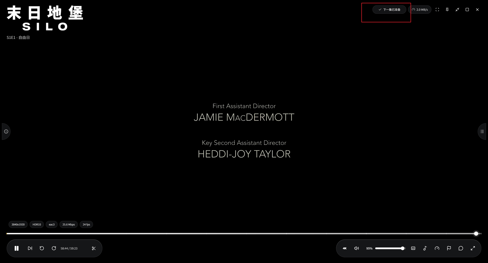 |  |

> Beta 功能對核心版本、媒體格式、伺服器回應與裝置效能有較高要求；遇到相容問題時可在設定中個別關閉。

## 💬 字幕與彈幕

字幕與彈幕擁有獨立設定，不需要依賴外部播放器介面完成常用調整。

- 支援伺服器字幕與本機字幕匯入；本機選擇器支援 ASS、SSA、SRT、VTT、SUB、SUP。
- 可設定預設字幕/音軌語言，並記憶播放中的軌道選擇。
- 字幕支援原始樣式、描邊陰影、淺色底與深色底模式。
- 可調整字型、顏色、字級、高度、延遲、描邊、陰影與背景透明度。
- 彈幕支援多 API 管理、字型與顏色、透明度、速度、顯示區域、同畫面數量與時間偏移。
- 可分別封鎖頂部、底部或捲動彈幕。

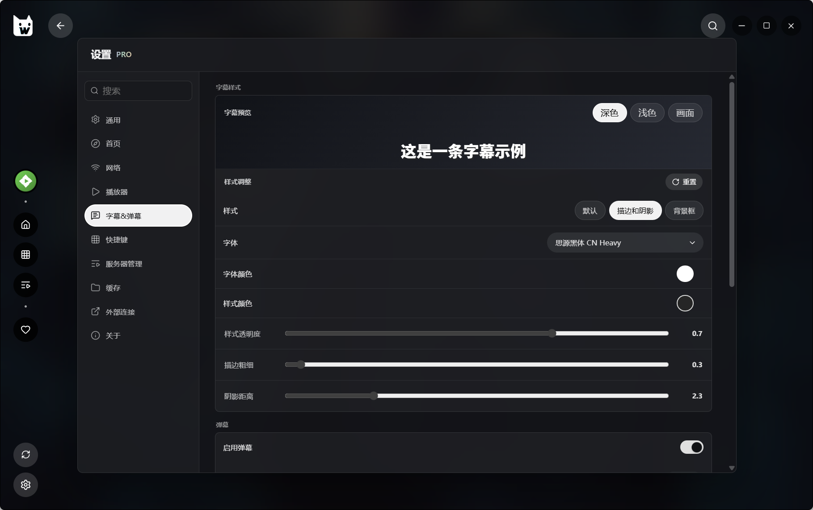

## 📚 片單與 Trakt

片單頁用來整理「想看什麼」與「依什麼順序看」，不受伺服器原有媒體庫結構限制。

- 提供收藏、待看與自訂片單。
- 支援建立、編輯、刪除與拖曳排序。
- 可從 Trakt 匯入清單，並繼續使用 Trakt 的播放進度與觀看狀態。
- 連接 Trakt 後可使用追劇日曆、個人清單、繼續觀看、收藏與推薦等資料。

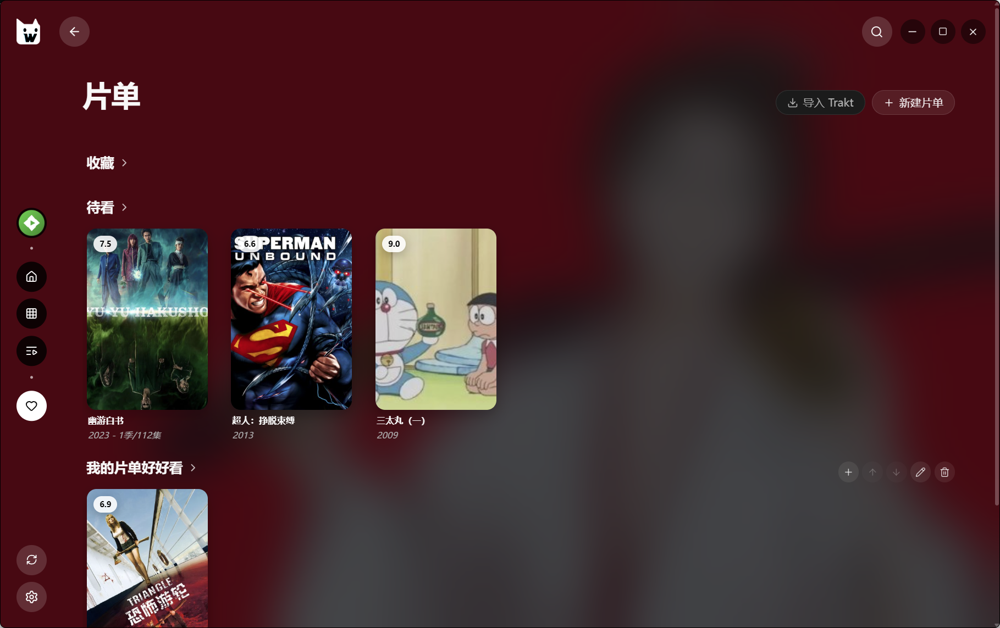

## 🖥️ 伺服器與線路管理

伺服器頁同時展示伺服器狀態與一般媒體來源。每台伺服器可維護備註、最近觀看時間、保號提醒、圖示、線路與彙整策略，方便長期管理多個帳號與入口。

- 伺服器卡片顯示類型、線上狀態、延遲、備註、上次觀看與保號提示。
- 每台伺服器可設定多條線路，拖曳排序、切換主要線路並獨立偵測延遲。
- 登入資訊與線路資訊分開維護，修改前可執行連線與登入驗證。
- 支援伺服器圖示庫、首頁輪播參與、Proxy 跟隨與媒體串流 Proxy。
- 彙整搜尋、繼續觀看、收藏與下一集預載都能依伺服器獨立開關。
- 支援 `.wwpcfg` 伺服器設定匯入與匯出，移轉時不包含 WebDAV 本機同步設定。

<table>
  <tr>
    <td width="50%">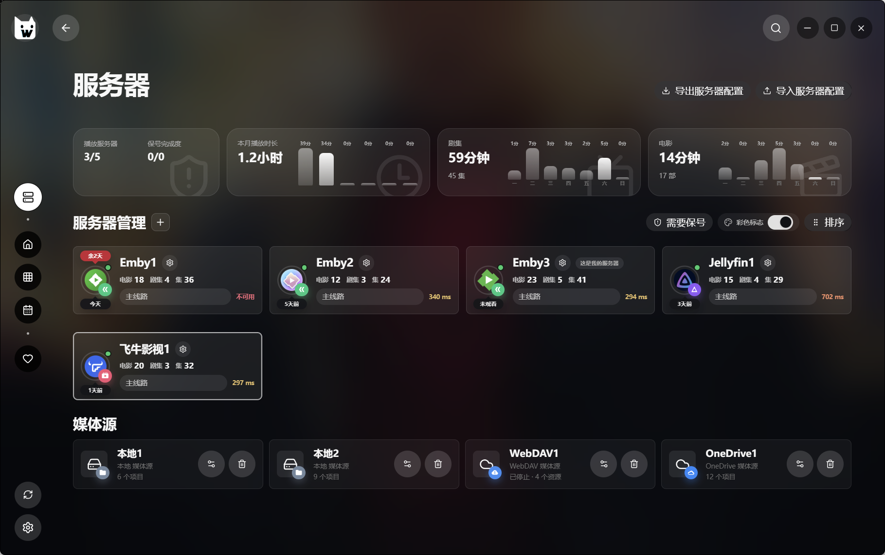</td>
    <td width="50%">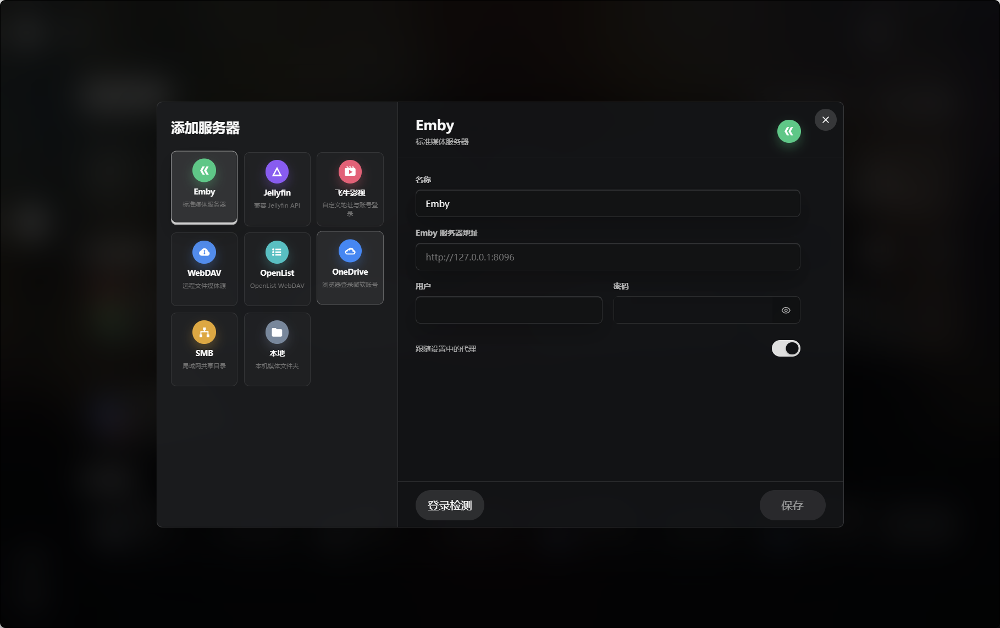</td>
  </tr>
  <tr>
    <td align="center">伺服器狀態、延遲、備註與保號提示</td>
    <td align="center">伺服器、網路儲存與本機媒體入口</td>
  </tr>
</table>

<table>
  <tr>
    <td width="50%">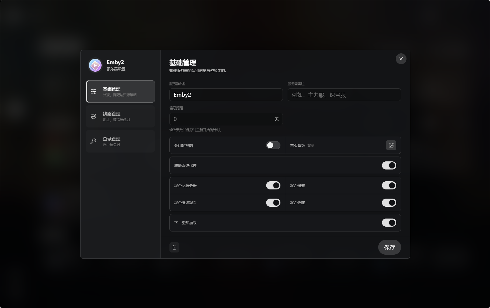</td>
    <td width="50%">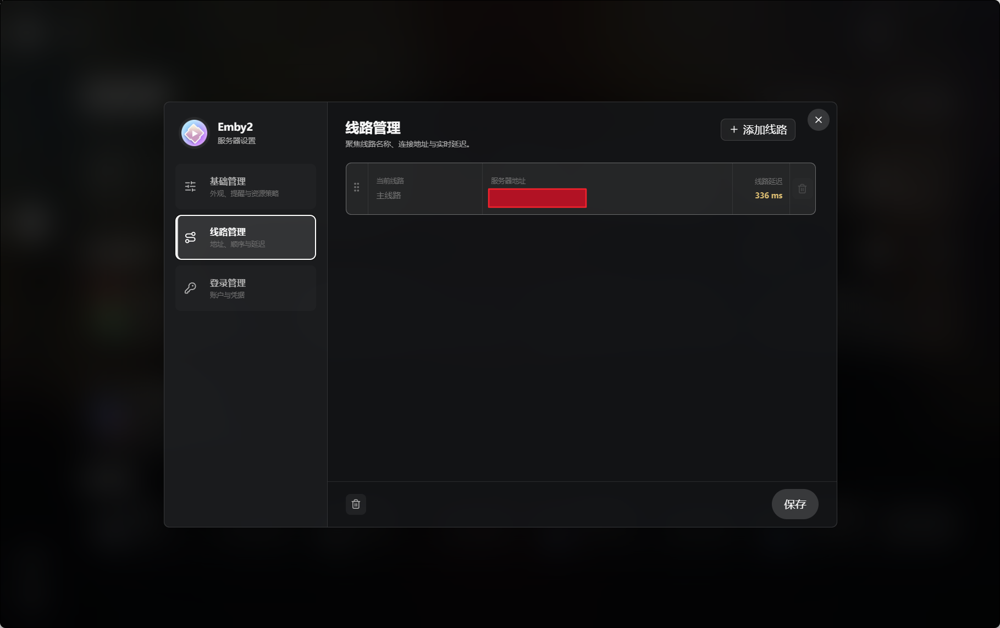</td>
  </tr>
  <tr>
    <td align="center">彙整、輪播、Proxy 與預載策略</td>
    <td align="center">多線路排序、切換與延遲偵測</td>
  </tr>
</table>

  
<strong>查看伺服器登入資訊管理</strong>

   
  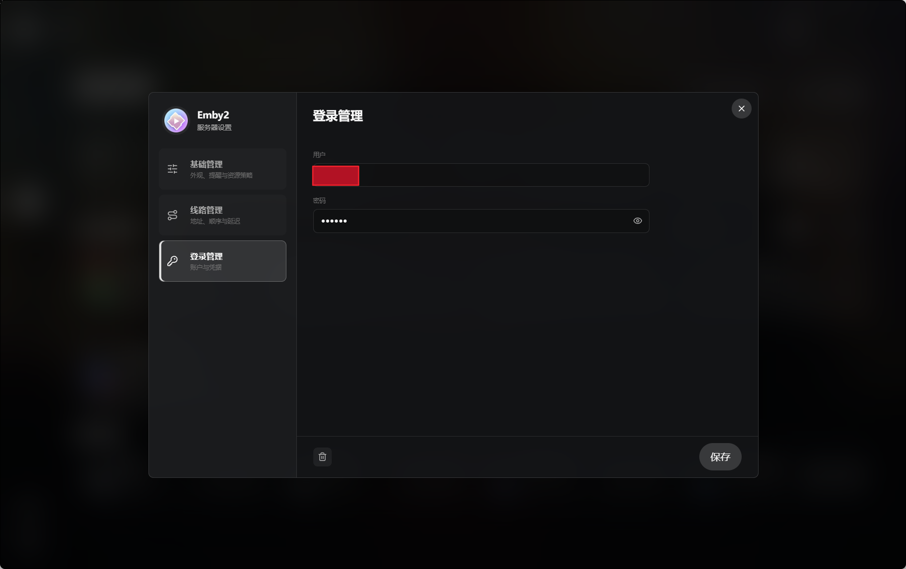

## ⚙️ 設定、網路與外部連線

- **網路**：不使用 Proxy、系統 Proxy 或手動 Proxy；媒體串流與 TMDB 可分別設定 Proxy 策略。
- **外部連線**：設定 TMDB、Trakt 與 WebDAV，多裝置設定同步可獨立啟用。
- **播放器**：內建/外部核心、快取、硬體解碼、GPU、音訊處理、時間軸縮圖與視窗行為。
- **彙整**：資源卡片展開方式、跨服搜尋/收藏/繼續觀看、參與伺服器與預載範圍。
- **介面**：淺色模式、背景輪播、毛玻璃效果與降低視覺效果模式。
- **維護**：快取管理、播放器記錄、效能診斷、記錄匯出與桌面捷徑。

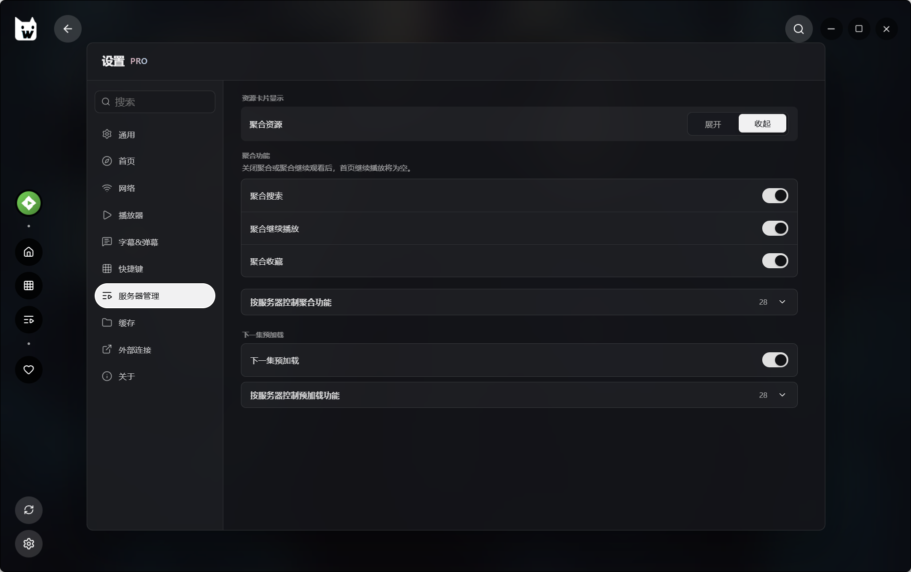

## 📦 下載與安裝

WWPlayer 1.1.6 支援 **Windows 10 1809 以上版本 / Windows 11，x64 架構**。

正式版僅透過 Microsoft Store 提供。點擊下方微軟官方徽章進入商店並下載安裝：

  

首次使用建議：

1. 開啟「伺服器」，新增媒體伺服器、網路儲存或本機資料夾。
2. 在「設定」中依需要設定 TMDB、Trakt、Proxy、字幕與播放器。
3. 返回首頁或探索頁，開啟詳情並選擇合適資源播放。

> [!TIP]
> 播放 HDR / Dolby Vision 內容時，請同時檢查 Windows HDR、顯示裝置、顯示卡驅動程式與連接鏈路。WWPlayer 可以辨識這些來源並執行相容輸出，但最終呈現仍取決於整套硬體與系統環境，不代表所有裝置都能原生直通 Dolby Vision 中繼資料。

## ℹ️ 相容性與說明

- README 截圖來自 WWPlayer 1.1.6；實際內容、海報、資源數量與可用操作取決於你自己的媒體來源。
- 部分彙整、探索模組與 WebDAV 設定同步能力可能依授權狀態不同，以應用程式內說明為準。
- 第三方服務名稱與商標歸各自權利人所有；WWPlayer 與其不存在未說明的隸屬或授權關係。
- 回報問題時建議附上軟體版本、來源類型、重現步驟與去識別化後的相關記錄。

## 🙏 相關專案與服務

[mpv](https://mpv.io/) · [Electron](https://www.electronjs.org/) · [React](https://react.dev/) · [TMDB](https://www.themoviedb.org/) · [Trakt](https://trakt.tv/) · [Emby](https://emby.media/) · [Jellyfin](https://jellyfin.org/)
